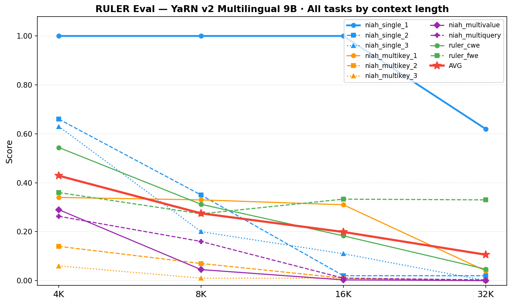
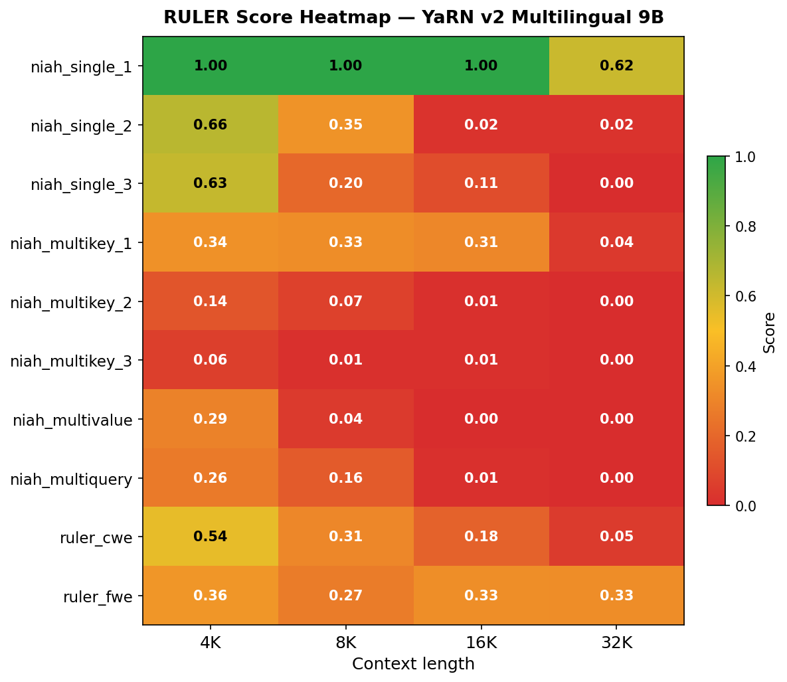
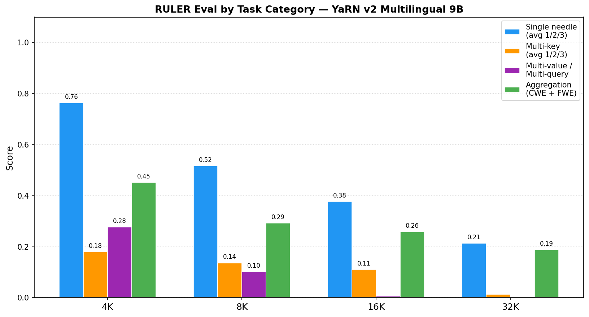

# RULER Eval — YaRN v2 Multilingual 9B (32K)

**Model:** [`birgermoell/oellm-9b-yarn-multilingual-v2-32k`](https://huggingface.co/birgermoell/oellm-9b-yarn-multilingual-v2-32k)  
**Cluster:** Leonardo (CINECA) — NVIDIA A100 64GB  
**Jobs:** 42990662 (4K/8K/16K, 2026-05-29), 44150956 (32K, 2026-06-03)  
**Samples:** 100 per task  
**Setup:** base LM, no instruction tuning, `--num_fewshot 0`, `dtype=bfloat16`

---

## Results

| Task | 4K | 8K | 16K | 32K | What it tests |
|------|-----|-----|------|------|---------------|
| niah_single_1 | 1.000 | 1.000 | 1.000 | 0.620 | Retrieve 1 short needle (easiest) |
| niah_single_2 | 0.660 | 0.350 | 0.020 | 0.020 | Retrieve 1 sentence needle |
| niah_single_3 | 0.630 | 0.200 | 0.110 | 0.000 | Retrieve 1 long-phrase needle |
| niah_multikey_1 | 0.340 | 0.330 | 0.310 | 0.040 | Find value among 2 keys |
| niah_multikey_2 | 0.140 | 0.070 | 0.010 | 0.000 | Find value among 4 keys |
| niah_multikey_3 | 0.060 | 0.010 | 0.010 | 0.000 | Find value among 8 keys |
| niah_multivalue | 0.290 | 0.045 | 0.003 | 0.000 | Retrieve all values for one key |
| niah_multiquery | 0.263 | 0.160 | 0.010 | 0.003 | Retrieve values for multiple keys |
| ruler_cwe | 0.544 | 0.312 | 0.183 | 0.047 | Extract most frequent words |
| ruler_fwe | 0.360 | 0.273 | 0.333 | 0.330 | Extract frequent words with distractors |
| **AVG** | **0.429** | **0.275** | **0.199** | **0.106** | |

---

## Figures

*Each line is one task. Red star = average across all tasks. The flat `ruler_fwe` line and the persistent `niah_single_1` performance up to 16K are the strongest positive signals.*

*Green = high score, red = low. The top row (niah_single_1) stays green through 16K before dropping at 32K. Multi-value and multi-query tasks (rows 7–8) go red almost immediately.*

*Grouped by difficulty category. Single-needle retrieval degrades gracefully; multi-key and multi-value tasks drop off sharply beyond 4K.*

---

## Task descriptions

### Needle In A Haystack (NIAH)

The model is given a long document filled with filler text (Paul Graham essays). A "needle" — a short synthetic fact like *"The secret code is 42819"* — is hidden at a random position. The model must retrieve the exact value when asked.

| Task | What it measures |
|------|-----------------|
| `niah_single_1` | Retrieve 1 needle. The needle is a simple UUID-style string. Easiest variant. |
| `niah_single_2` | Retrieve 1 needle. The needle is a short sentence — slightly harder to extract by continuation. |
| `niah_single_3` | Retrieve 1 needle. The needle is a longer phrase — hardest single-needle variant. |
| `niah_multikey_1` | The needle has 2 keys; retrieve the value matching the queried key. Tests key disambiguation. |
| `niah_multikey_2` | Same but 4 keys — harder disambiguation. |
| `niah_multikey_3` | Same but 8 keys — requires the model to distinguish among many similar-looking entries. |
| `niah_multivalue` | One key maps to multiple values; retrieve all of them. Requires generating a list. |
| `niah_multiquery` | Multiple needles are hidden; retrieve the values for all queried keys in one pass. |

Scoring: exact string match (or token-level F1 for multi-value). A base LM scores by generating a continuation — it doesn't "know" to stop after the answer, so multi-value/multi-query tasks are especially hard without instruction tuning.

### Aggregation tasks

| Task | What it measures |
|------|-----------------|
| `ruler_cwe` | **Common Words Extraction** — given a long list of words with repetitions, output the K most frequent ones. Tests whether the model can aggregate counts over a long context. |
| `ruler_fwe` | **Frequent Words Extraction** — same idea but the list contains noisy distractor words at low frequency. Tests signal/noise separation over long contexts. |

Scoring: set overlap between predicted words and ground-truth frequent words.

---

## Analysis

### What works well

- **`niah_single_1` = 1.0 at 4K, 8K, and 16K.** The model can reliably retrieve a single clearly-delimited fact anywhere in the context. This is the primary confirmation that the YaRN extension is working — without it, performance would degrade much earlier.
- **`ruler_fwe` stays flat at 0.27–0.36 across all lengths.** Frequent-word extraction with distractors is robust to context length, suggesting the model maintains broad attention over long sequences rather than just attending to recent tokens.
- **`niah_multikey_1` holds at 0.31–0.34 up to 16K.** The model can distinguish between 2 competing keys even at 16K context — moderate multi-key robustness within the trained range.

### Where it degrades

- **`niah_single_1` drops at 32K (1.0 → 0.62).** The easiest retrieval task degrading at the maximum context length is the most important signal. It indicates the model is approaching its reliable limit and would benefit from more training at 32K.
- **Multi-value and multi-query tasks collapse quickly.** `niah_multivalue` goes 0.29 → 0.05 → 0.00 → 0.00. These tasks require generating structured lists — a base LM without instruction tuning struggles to format output correctly. This is partly an eval setup issue, not just a context length issue.
- **`ruler_cwe` degrades smoothly** (0.54 → 0.31 → 0.18 → 0.05), showing the model progressively loses the ability to aggregate word counts as context grows.
- **Average drops from 0.43 → 0.28 → 0.20 → 0.11** — a consistent halving every time context doubles. This is a reasonable degradation curve for a base LM at its context limit.

### Things to focus on for further experiments

1. **Instruction-tune the model.** Multi-key, multi-value, and multi-query scores will improve substantially with instruction tuning — the base LM cannot produce the structured output these tasks expect. An instruction-tuned version is the fairest comparison point.

2. **Extend context to 64K/128K.** The `niah_single_1` drop at 32K suggests the model isn't fully saturated at the maximum trained length. More training at longer contexts (staged: 32K → 64K → 128K) should push single-needle scores back to 1.0.

3. **Train longer at 32K.** The current model was trained for ~1K steps. More steps at the 32K stage may recover the `niah_single_1` regression without needing to go to a longer context first — cheaper to try.

4. **Evaluate multilingual NIAH.** All RULER tasks above use English haystacks. A multilingual NIAH (needles and haystacks in each of the 35 trained languages) would reveal whether context extension generalises equally across languages or degrades unevenly for lower-resource ones.

5. **Run on a pre-YaRN baseline.** Comparing these scores against the base model without context extension would quantify the exact gain from YaRN training and confirm there is no regression on shorter contexts.
