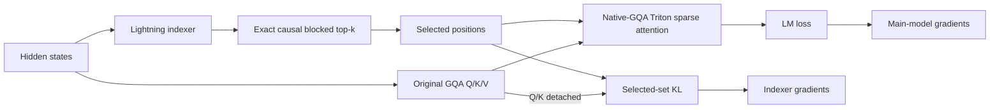

# OpenEuroLLM DeepSeek Sparse Attention work

**Status date:** 2026-07-28
**Scope:** OpenEuroLLM 9B GQA long-context research on LUMI
**Canonical implementation:** `scripts/dsa/` in this repository
**Current verdict:** the DSA mechanism and both gradient paths are correct at 8K. It is not yet
ready for sustained sparse adaptation, context parallelism, 512K–2M training, or sparse decoding.

## Executive summary

We have moved beyond a toy sparse-attention mask:

- A 300-step, all-layer lightning-indexer warm-up completed with finite losses and gradients.
- Exact causal blocked top-k selection matches a dense reference.
- The sparse core keeps K/V in native GQA form and its ROCm Triton forward and backward match a
  dense reference.
- Sparse adaptation now follows the DeepSeek two-objective design: language-model loss trains the
  main model through sparse attention, while selected-set KL trains a detached indexer.
- A one-step full-model integration gate loaded the warm checkpoint and produced finite LM loss,
  indexer loss, and nonzero gradients in both parameter families.
- Unsupported combinations fail closed instead of silently falling back to a wrong or dense path.

This proves the 8K training mechanism. It does **not** prove that the current implementation scales
to a million tokens. Core sparse attention is O(Lk), but the exact indexer still performs O(L²)
arithmetic. Context-parallel global selection and inference are not implemented.

## Why DSA

Dense attention makes every query attend to every earlier key. Its score matrix grows as O(L²),
which is the central memory and compute obstacle at 512K–2M tokens.

DeepSeek Sparse Attention adds a small lightning indexer. For query t and candidate key s it scores

`I(t,s) = Σ_j w(t,j) · ReLU(qI(t,j) · kI(s))`

and selects the causal top-k keys. The model's original Q/K/V attention is then evaluated only on
those selected positions. The indexer chooses positions; it does not replace the model's content
attention.

For this model, k=2048 is a useful first target. At 8K it retains 25% of the prefix and is mainly a
correctness/adaptation test. At 1M it would retain about 0.2%, where sparsity becomes material.

## The two training phases

### 1. Frozen-model indexer warm-up

Dense attention remains the teacher. All base-model parameters are frozen and only the new indexer
is trained to approximate the attention-mass distribution. The teacher is detached, so warm-up
cannot alter the language model.

The important metric is attention-mass recall at the target k, not LM loss alone. Recall is logged
per layer and by query-position quartile because late-token averages can conceal weak early or
middle positions.

### 2. Sparse adaptation

The sparse kernel replaces dense content attention in every global-attention layer. Two independent
gradient paths must remain active:

1. LM loss → sparse attention → main-model parameters.
2. Selected-set KL → lightning indexer only, with main-model Q/K detached.

An earlier prototype disabled KL in sparse mode. That was incorrect: the indexer would no longer be
trained as the main model adapted. The current overlay refuses to start sparse adaptation unless
`DSA_SPARSE=1`, the loss coefficient is positive, and the base model is unfrozen.

## Why the implementation lives here, not in a Megatron fork

This repository owns the experiment-specific overlay, tests, launchers, results, and design
decisions. Megatron remains a pinned external dependency.

At runtime, `scripts/dsa` is placed before the Megatron checkout on `PYTHONPATH`:

1. `gpt_builders.py` is a small import shim.
2. `gpt_builders_dsa.py` creates the DSA-aware layer specification and performs fail-closed
   checkpoint loading.
3. `megatron_gqa_dsa.py` supplies the GQA attention/module specs.
4. `dsa_patches.py` installs the validated sparse selection, selected-set KL, recall logging, and
   Triton core against Megatron's experimental DSA interfaces.

This keeps the work reviewable and reproducible without carrying a private Megatron tree. It also
makes the dependency boundary visible. The validated LUMI checkout was clean at
`b359462c12858cedd2238a22eca0dca7aa6b8872`; `scripts/dsa/MEGATRON_REVISION` pins it and the
correctness launcher rejects a mismatch.

### When an upstream Megatron change would make sense

Upstreaming is useful only after the training and inference design stabilizes. At that point we
would:

1. pin the exact Megatron base commit and turn the overlay into a focused branch;
2. move generic GQA DSA support into Megatron's experimental-attention variant;
3. add explicit TransformerConfig/CLI fields instead of environment bridges and monkey patches;
4. add CPU, CUDA/ROCm, checkpoint, TP, PP, and CP tests;
5. implement a registered sparse prefill/decode backend rather than overriding `unfused_dsa_fn`;
6. preserve load compatibility for dense checkpoints and DSA checkpoints; and
7. submit the generic pieces upstream while keeping OpenEuroLLM launch policy in this repository.

Until those gates pass, changing a shared Megatron checkout would make iteration and rollback
harder without solving the remaining algorithmic gaps.

## Current architecture

Important properties:

- all 36 layers default to sparse-capable (`S`) blocks;
- K/V remain 8 native GQA groups for 32 query heads;
- the indexer uses non-interleaved RoPE, matching DeepSeek's corrected convention;
- selection is exactly causal and uses int32 indices with `-1` sentinels;
- full score-matrix allocation is avoided by query/key blocking;
- selected-set retention is guarded by `DSA_MAX_RETAINED_SELECTION_BYTES`;
- packed sequences, attention bias, non-causal masks, unequal query/key lengths, and CP>1 fail
  closed in the current sparse path.

## Evidence from LUMI

### Frozen-indexer pilot — job 20291047

Configuration: 300 steps, 8K, all 36 layers DSA-capable, TP=8, CP=1, frozen base model.

Final recorded values:

| Signal | Result |
|---|---:|
| LM loss | 1.796945 |
| Indexer loss | 0.538071 |
| Gradient norm | 785.173 |
| Skipped / NaN iterations | 0 / 0 |
| Last observed top-2048 attention-mass recall | 0.789 |

Recall varies by layer and sampled position, so the last number is not a model-wide average.
Complete checkpoints exist at iterations 50, 100, 150, 200, 250, and 300. A separate reload
validator successfully loaded checkpoint 300.

### Standalone correctness — job 20336318

The promoted `test_dsa_correctness.py` gates passed:

- exact causal blocked top-k scores and indices versus a dense reference;
- finite, nonzero selection gradients;
- selected-set KL versus a dense native-GQA teacher;
- non-interleaved Megatron RoPE convention; and
- ROCm Triton native-GQA forward and backward versus dense attention.

### Full sparse integration — job 20336946

This one-step, no-save gate loaded warm-up checkpoint 300 and executed iteration 301 with the main
model unfrozen and selected-set KL enabled.

| Signal | Result |
|---|---:|
| LM loss | 1.787646 |
| Indexer loss | 0.553794 |
| Gradient norm | 175.841 |
| NaN / skipped | 0 / 0 |
| Layer-1 recall at top-512 / 1024 / 2048 | 0.487 / 0.638 / 0.802 |
| Top-2048 query-position quartiles | 1.000 / 0.892 / 0.715 / 0.601 |
| Update time | 31.9 s |

Both the main-model and indexer gradient probes were finite and nonzero. This is a correctness
gate, not a quality or throughput result.

## What Kimi K3 contributes—and what it does not

The [Kimi K3 technical report](https://github.com/MoonshotAI/Kimi-K3/blob/main/k3_tech_report.pdf)
is useful for long-context curriculum and data design, but it is not a DSA recipe. K3 uses Kimi
Delta Attention (a linear/delta-attention architecture) and NoPE rather than the RoPE-based GQA
model used here.

The transferable lessons are:

- clean and structurally validate long documents;
- use exact and fuzzy deduplication;
- upsample coherent long-form sources;
- add synthetic tasks that require evidence distributed across the whole context;
- extend progressively rather than jumping from short context to 1M; K3 moves 8K→64K during
  pretraining; and
- reserve a cooldown curriculum for 256K→1M adaptation.

The non-transferable part is KDA/NoPE itself. OpenEuroLLM still needs correct RoPE scaling and the
non-interleaved indexer convention.

## Readiness matrix

| Capability | State | Evidence / blocker |
|---|---|---|
| Indexer warm-up | Validated at 8K | 300-step run and checkpoint reload |
| Exact causal selection | Validated | Dense-reference tests |
| Native-GQA sparse core | Validated at small/8K scale | ROCm Triton fwd/bwd and integration gate |
| Dual LM + selected-KL gradients | Validated for one step | Job 20336946 |
| Sustained sparse adaptation | Not run | Next quality gate |
| Sparse checkpoint save/reload | Not validated | Must follow a multi-step run |
| Context parallelism | Not implemented | Needs distributed global top-k and KV exchange |
| 128K+ memory behavior | Not validated | Selection/KL retention and indexer cost |
| 512K–2M training | Blocked | CP plus scalable indexer/KL required |
| Sparse prefill | Not implemented | Current path assumes aligned full self-attention |
| Sparse decode / KV cache | Not implemented | Needs paged cache and q-length-1 kernels |
| HF export and serving | Not implemented | Requires architecture/config and runtime support |

## Remaining build work

### P0 — prove trainability before scaling

1. Run 100–500 sparse-adaptation steps at 8K with all 36 `S` layers, k=2048, TP=8, CP=1,
   selected-set KL on, and both gradient probes.
2. Save intermediate and final checkpoints; reload one and continue for several steps.
3. Compare dense and sparse loss/logits on fixed held-out batches before and after adaptation.
4. Measure short-context retention plus long-context retrieval (NIAH/RULER-style) against the
   dense 256K model.
5. Record separate indexer, selection, sparse-core, KL, and optimizer timings.
6. Define explicit stop gates for NaNs, zero gradient family, recall collapse, short-context
   regression, or checkpoint mismatch.

### P1 — make long training possible

#### Context-parallel global top-k

The current code intentionally rejects CP>1. Correct CP requires:

1. compute local candidate scores using global causal positions;
2. select a deterministic local top-k on each sequence shard;
3. merge candidates into an exact or explicitly approximate global top-k;
4. fetch/exchange the selected K/V rows;
5. propagate gradients through the chosen distributed data movement; and
6. test equality against CP=1 for small sequences, including ties and checkpoint resume.

Without this, simply setting `--context-parallel-size` produces wrong selection or hidden dense
work.

#### Stream or recompute the selected-set KL

Exact blocked selection avoids an L×L score tensor, but it currently returns scores and int32
indices of shape B×L×k. At L=1,048,576 and k=2048, fp32 scores plus int32 indices are about 16 GiB
per layer before other activations. The default 2 GiB safety guard therefore refuses roughly
beyond 131K tokens at batch one and k=2048.

We need a fused or streamed design that consumes query blocks, computes sparse attention and KL,
and releases selected scores/indices before processing the next block. Activation recomputation
may further reduce retained state.

#### Replace the exact O(L²) indexer when needed

Blocking fixes peak score memory, not arithmetic. Before 512K–2M, benchmark the indexer separately.
If it dominates, introduce a tested candidate-generation hierarchy (for example coarse blocks then
fine token selection) with an exact-path oracle and recall/quality gates. Approximation must be an
explicit experiment, not a silent replacement.

### P1 — implement inference

Training prefill correctness does not provide a usable long-context model. We still need:

- sparse prefill with padding and variable sequence lengths;
- decoding with query length one and absolute cache positions;
- paged KV-cache lookup for selected positions;
- a policy for recent-window and sink/global tokens;
- cache quantization/offload if required at 1M–2M;
- deterministic batching and prefix-cache behavior; and
- Hugging Face/export configuration plus a serving backend.

DeepSeek's [FlashMLA](https://github.com/deepseek-ai/FlashMLA) is a useful reference for the
separation between token-level sparse prefill and sparse decoding, but its MLA cache layout is not
a drop-in match for this GQA model.

### P2 — performance and generality

- fuse the current Python batch/head launch loop into a larger Triton grid and autotune tiles;
- benchmark BF16 and possible FP8 cache/index paths on MI250X;
- add padding/custom-mask and packed-sequence semantics;
- validate PP>1 logging/collectives and heterogeneous checkpoint layouts;
- define deterministic top-k tie-breaking across devices; and
- use dense attention below a measured short-context crossover if it is faster.

## Recommended sequence of experiments

1. **8K sustained gate:** 100–500 steps, save/reload, dense-vs-sparse quality check.
2. **16K/32K kernel gate:** characterize memory and time; keep CP=1.
3. **CP correctness gate:** CP=2 then CP=4 on small sequences, exact comparison with CP=1.
4. **64K/128K adaptation:** progressive context and data mixture; validate retrieval and
   short-context retention.
5. **Streamed KL/indexer gate:** remove the B×L×k retained-state bottleneck.
6. **256K/512K training:** only after CP and memory gates pass.
7. **1M then 2M:** progressive curriculum with K3-style coherent/synthetic long-context data.
8. **Inference track:** sparse prefill and decode must pass independently before publishing a
   practically usable sparse model.

No 512K sparse job should be submitted from the archived `sparse_512k.sbatch`. It is deliberately
fail-closed because it combines unsupported CP with an obsolete sparse-loss configuration.

## Source map

- `scripts/dsa/chunked_indexer.py` — exact causal blocked top-k and retention guard
- `scripts/dsa/MEGATRON_REVISION` — validated external Megatron commit
- `scripts/dsa/dsa_sparse_loss.py` — native-GQA selected-set KL
- `scripts/dsa/dsa_patches.py` — sparse path, fail-closed checks, recall logging
- `scripts/dsa/triton_dsa.py` — ROCm Triton sparse attention forward/backward
- `scripts/dsa/megatron_gqa_dsa.py` — Megatron GQA DSA module specifications
- `scripts/dsa/gpt_builders_dsa.py` — config bridge, checkpoint loading, gradient probes
- `scripts/dsa/test_dsa_correctness.py` — dense-reference correctness gates
- `scripts/dsa/lumi/dsa_sparse_8k_correctness.sbatch` — reproducible one-step LUMI gate

## Primary references

- [DeepSeek-V3.2 technical report](https://arxiv.org/html/2512.02556) — DSA architecture and
  warm-up/sparse-training objectives
- [DeepSeek-V3.2-Exp official repository](https://github.com/deepseek-ai/DeepSeek-V3.2-Exp) —
  kernels and the corrected non-interleaved indexer RoPE note
- [FlashMLA](https://github.com/deepseek-ai/FlashMLA) — sparse prefill/decode kernel reference
- [Kimi K3 technical report](https://github.com/MoonshotAI/Kimi-K3/blob/main/k3_tech_report.pdf) —
  progressive long-context curriculum and data guidance
