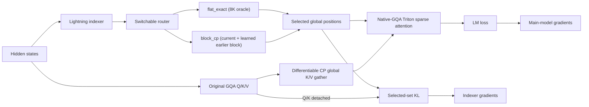

# OpenEuroLLM DeepSeek Sparse Attention work

**Status date:** 2026-08-10
**Scope:** OpenEuroLLM 9B GQA long-context research on LUMI
**Canonical implementation:** `scripts/dsa/` in this repository
**Current verdict:** the DSA mechanism and both gradient paths are correct at 8K. A standalone,
fail-closed 512K/CP16 training candidate is implemented and passes CPU/layout/autograd tests. It
still requires the staged 8K save/reload and 64K/CP2 GPU gates before the 512K job is submitted.
The current full-K/V CP gather is a 512K correctness bridge, not the final 1M–2M transport.

## Executive summary

We have moved beyond a toy sparse-attention mask:

- A 300-step, all-layer lightning-indexer warm-up completed with finite losses and gradients.
- Exact causal blocked top-k selection matches a dense reference.
- The sparse core keeps K/V in native GQA form and its ROCm Triton forward and backward match a
  dense reference.
- Sparse adaptation now follows the DeepSeek two-objective design: language-model loss trains the
  main model through sparse attention, while selected-set KL trains a detached indexer.
- A one-step full-model integration gate loaded the warm checkpoint and produced finite LM loss,
  indexer loss, and nonzero gradients in both parameter families.
- A hierarchical `block_cp` router now keeps the causal current 256-token block and selects one
  learned earlier global block (512 retained slots total) without an L×L indexer matrix.
- Differentiable CP all-gather restores Megatron's zig-zag shards to canonical global token order;
  Triton forward and backward use each query's global causal position.
- Three launch gates exercise 8K/CP1, 64K/CP2, and 512K/CP16. Each saves full training state and
  reloads it in a fresh Python process before a second update.
- Unsupported combinations fail closed instead of silently falling back to a wrong or dense path.

The 8K mechanism is proven; the new distributed path is implemented but not yet GPU-integrated.
It does **not** prove million-token efficiency. The 512K bridge replicates global K/V and indexer
K on every CP rank, and selected-set state is still B×local-L×k. Sparse decoding is not implemented.

## Why DSA

Dense attention makes every query attend to every earlier key. Its score matrix grows as O(L²),
which is the central memory and compute obstacle at 512K–2M tokens.

DeepSeek Sparse Attention adds a small lightning indexer. For query t and candidate key s it scores

`I(t,s) = Σ_j w(t,j) · ReLU(qI(t,j) · kI(s))`

and selects the causal top-k keys. The model's original Q/K/V attention is then evaluated only on
those selected positions. The indexer chooses positions; it does not replace the model's content
attention.

The exact 8K oracle used k=2048. The 512K bridge uses k=512: the current 256-token block plus one
learned earlier 256-token block. This is deliberately a pipeline/correctness experiment, not yet a
claim that two blocks preserve enough attention mass for quality.

## The two training phases

### 1. Frozen-model indexer warm-up

Dense attention remains the teacher. All base-model parameters are frozen and only the new indexer
is trained to approximate the attention-mass distribution. The teacher is detached, so warm-up
cannot alter the language model.

The important metric is attention-mass recall at the target k, not LM loss alone. Recall is logged
per layer and by query-position quartile because late-token averages can conceal weak early or
middle positions.

### 2. Sparse adaptation

The sparse kernel replaces dense content attention in every global-attention layer. Two independent
gradient paths must remain active:

1. LM loss → sparse attention → main-model parameters.
2. Selected-set KL → lightning indexer only, with main-model Q/K detached.

An earlier prototype disabled KL in sparse mode. That was incorrect: the indexer would no longer be
trained as the main model adapted. The current overlay refuses to start sparse adaptation unless
`DSA_SPARSE=1`, the loss coefficient is positive, and the base model is unfrozen.

## Why the implementation lives here, not in a Megatron fork

This repository owns the experiment-specific overlay, tests, launchers, results, and design
decisions. Megatron remains a pinned external dependency.

At runtime, `scripts/dsa` is placed before the Megatron checkout on `PYTHONPATH`:

1. `gpt_builders.py` is a small import shim.
2. `gpt_builders_dsa.py` creates the DSA-aware layer specification and performs fail-closed
   checkpoint loading.
3. `megatron_gqa_dsa.py` supplies the GQA attention/module specs.
4. `dsa_patches.py` installs the validated sparse selection, selected-set KL, recall logging, and
   Triton core against Megatron's experimental DSA interfaces.

The launcher uses `python -m pretrain_gpt`. Directly executing `$MEG/pretrain_gpt.py` puts the
Megatron directory at `sys.path[0]` and can silently import Megatron's dense `gpt_builders.py`
instead of this overlay. The preflight checks both resolved module origins before allocating model
state; this exact shadowing error caused the failed historical save attempt 20344682.

This keeps the work reviewable and reproducible without carrying a private Megatron tree. It also
makes the dependency boundary visible. The validated LUMI checkout was clean at
`b359462c12858cedd2238a22eca0dca7aa6b8872`; `scripts/dsa/MEGATRON_REVISION` pins it and the
correctness launcher rejects a mismatch.

### When an upstream Megatron change would make sense

Upstreaming is useful only after the training and inference design stabilizes. At that point we
would:

1. pin the exact Megatron base commit and turn the overlay into a focused branch;
2. move generic GQA DSA support into Megatron's experimental-attention variant;
3. add explicit TransformerConfig/CLI fields instead of environment bridges and monkey patches;
4. add CPU, CUDA/ROCm, checkpoint, TP, PP, and CP tests;
5. implement a registered sparse prefill/decode backend rather than overriding `unfused_dsa_fn`;
6. preserve load compatibility for dense checkpoints and DSA checkpoints; and
7. submit the generic pieces upstream while keeping OpenEuroLLM launch policy in this repository.

Until those gates pass, changing a shared Megatron checkout would make iteration and rollback
harder without solving the remaining algorithmic gaps.

## Current architecture

Important properties:

- all 36 layers default to sparse-capable (`S`) blocks;
- K/V remain 8 native GQA groups for 32 query heads;
- the indexer uses non-interleaved RoPE, matching DeepSeek's corrected convention;
- selection is globally causal and uses int32 indices with `-1` sentinels;
- `flat_exact` avoids the full matrix allocation but remains O(L²) arithmetic;
- `block_cp` uses 256-token blocks, routes from the first query in each block to avoid future-token
  leakage, and guarantees that the causal portion of the current block is retained;
- Megatron CP rank order is explicitly reversed into global token order, with summed gradients on
  the backward collective;
- selected-set retention is guarded by `DSA_MAX_RETAINED_SELECTION_BYTES`;
- packed sequences, attention bias, non-causal masks, PP>1 for the 512K gate, misaligned block/CP
  layouts, and contexts above the validated 524288 cap fail closed.

## Evidence from LUMI

### Frozen-indexer pilot — job 20291047

Configuration: 300 steps, 8K, all 36 layers DSA-capable, TP=8, CP=1, frozen base model.

Final recorded values:

| Signal | Result |
|---|---:|
| LM loss | 1.796945 |
| Indexer loss | 0.538071 |
| Gradient norm | 785.173 |
| Skipped / NaN iterations | 0 / 0 |
| Last observed top-2048 attention-mass recall | 0.789 |

Recall varies by layer and sampled position, so the last number is not a model-wide average.
Complete checkpoints exist at iterations 50, 100, 150, 200, 250, and 300. A separate reload
validator successfully loaded checkpoint 300.

### Standalone correctness — job 20336318

The promoted `test_dsa_correctness.py` gates passed:

- exact causal blocked top-k scores and indices versus a dense reference;
- finite, nonzero selection gradients;
- selected-set KL versus a dense native-GQA teacher;
- non-interleaved Megatron RoPE convention; and
- ROCm Triton native-GQA forward and backward versus dense attention.

### Full sparse integration — job 20336946

This one-step, no-save gate loaded warm-up checkpoint 300 and executed iteration 301 with the main
model unfrozen and selected-set KL enabled.

| Signal | Result |
|---|---:|
| LM loss | 1.787646 |
| Indexer loss | 0.553794 |
| Gradient norm | 175.841 |
| NaN / skipped | 0 / 0 |
| Layer-1 recall at top-512 / 1024 / 2048 | 0.487 / 0.638 / 0.802 |
| Top-2048 query-position quartiles | 1.000 / 0.892 / 0.715 / 0.601 |
| Update time | 31.9 s |

Both the main-model and indexer gradient probes were finite and nonzero. This is a correctness
gate, not a quality or throughput result.

## What Kimi K3 contributes—and what it does not

The [Kimi K3 technical report](https://github.com/MoonshotAI/Kimi-K3/blob/main/k3_tech_report.pdf)
is useful for long-context curriculum and data design, but it is not a DSA recipe. K3 uses Kimi
Delta Attention (a linear/delta-attention architecture) and NoPE rather than the RoPE-based GQA
model used here.

The transferable lessons are:

- clean and structurally validate long documents;
- use exact and fuzzy deduplication;
- upsample coherent long-form sources;
- add synthetic tasks that require evidence distributed across the whole context;
- extend progressively rather than jumping from short context to 1M; K3 moves 8K→64K during
  pretraining; and
- reserve a cooldown curriculum for 256K→1M adaptation.

The non-transferable part is KDA/NoPE itself. OpenEuroLLM still needs correct RoPE scaling and the
non-interleaved indexer convention.

## Readiness matrix

| Capability | State | Evidence / blocker |
|---|---|---|
| Indexer warm-up | Validated at 8K | 300-step run and checkpoint reload |
| Exact causal selection | Validated | Dense-reference tests |
| Native-GQA sparse core | Validated at small/8K scale | ROCm Triton fwd/bwd and integration gate |
| Dual LM + selected-KL gradients | Validated for one step | Job 20336946 |
| Sustained sparse adaptation | Not run | Next quality gate |
| Sparse checkpoint save/reload | Implemented, GPU gate pending | 8K round-trip launcher |
| Context parallelism | Implemented, GPU gate pending | Zig-zag gather/autograd CPU tests; CP2 next |
| Hierarchical candidate generation | Implemented, quality unmeasured | 256-token current + 1 routed block |
| 128K+ memory behavior | Not validated | 64K/CP2 keeps final 32K local length and is the memory gate |
| 512K training | Prepared, gated | Run only after 8K and 64K round trips pass |
| 1M–2M training | Blocked | Replace replicated global K/V and reduce/stream selected state |
| Sparse prefill | Not implemented | Current path assumes aligned full self-attention |
| Sparse decode / KV cache | Not implemented | Needs paged cache and q-length-1 kernels |
| HF export and serving | Not implemented | Requires architecture/config and runtime support |

## Remaining build work

### P0 — execute the prepared correctness ladder

1. Run `dsa_sparse_8k_roundtrip.sbatch`: GPU dense-reference tests, two-rank RCCL gather test,
   update 301, full checkpoint, fresh-process reload, update 302.
2. If and only if that passes, run `dsa_sparse_64k_cp2_roundtrip.sbatch`. Its CP-local length is
   32K, matching the final CP16 topology, so it is the cheap communication/memory gate.
3. If and only if that passes, run `dsa_sparse_512k_cp16_roundtrip.sbatch` on 16 nodes. Success
   requires finite LM/indexer losses and both gradient probes plus complete iterations 301/302.
4. Compare dense and sparse loss/logits on fixed held-out batches before any sustained run.
5. Only then choose a longer adaptation schedule and evaluate short-context retention and
   NIAH/RULER-style retrieval against the dense 256K model.

### P1 — make long training possible

#### Replace the correctness-first CP transport

The current `block_cp` implementation is correct-by-construction for the prepared layout:

1. indexer K and main-model K/V are differentiably gathered across CP;
2. rank-order zig-zag chunks are restored to canonical global order;
3. the learned router selects globally indexed earlier blocks;
4. forward and backward causality use the local query's global position; and
5. collective backward sums contributions before returning each source rank's local gradient.

This replicates roughly 128 MiB each of BF16 K, V, and indexer K per TP rank at 512K (before
gradients/workspace). It is acceptable for the bounded 512K test, but 1M–2M should exchange only
block summaries and selected K/V rows rather than replicate the full sequence.

#### Stream or recompute the selected-set KL

The CP-local selected scores and int32 indices have shape B×(L/CP)×k. At the prepared 512K/CP16,
k=512 configuration this is about 128 MiB per rank before recomputation effects. At 1M–2M or with
larger k, stream or recompute query blocks rather than retain the whole local selected set.

We need a fused or streamed design that consumes query blocks, computes sparse attention and KL,
and releases selected scores/indices before processing the next block. Activation recomputation
may further reduce retained state.

#### Replace the exact O(L²) indexer when needed

`block_cp` removes the flat O(L²) token scorer, but its coarse route (one earlier block chosen from
global block summaries) is an explicit approximation. Benchmark it against `flat_exact` at 8K,
measure attention-mass recall and retrieval quality, then evaluate more routed blocks or a
coarse-to-fine token selector. Approximation must remain a named router, never a silent fallback.

### P1 — implement inference

Training prefill correctness does not provide a usable long-context model. We still need:

- sparse prefill with padding and variable sequence lengths;
- decoding with query length one and absolute cache positions;
- paged KV-cache lookup for selected positions;
- a policy for recent-window and sink/global tokens;
- cache quantization/offload if required at 1M–2M;
- deterministic batching and prefix-cache behavior; and
- Hugging Face/export configuration plus a serving backend.

DeepSeek's [FlashMLA](https://github.com/deepseek-ai/FlashMLA) is a useful reference for the
separation between token-level sparse prefill and sparse decoding, but its MLA cache layout is not
a drop-in match for this GQA model.

### P2 — performance and generality

- fuse the current Python batch/head launch loop into a larger Triton grid and autotune tiles;
- benchmark BF16 and possible FP8 cache/index paths on MI250X;
- add padding/custom-mask and packed-sequence semantics;
- validate PP>1 logging/collectives and heterogeneous checkpoint layouts;
- define deterministic top-k tie-breaking across devices; and
- use dense attention below a measured short-context crossover if it is faster.

## Recommended sequence of experiments

1. **8K round trip:** GPU oracle + RCCL collective + save/reload.
2. **64K/CP2 round trip:** same 32K local sequence as the final job.
3. **512K/CP16 round trip:** two sparse updates with a full checkpoint boundary.
4. **Quality gate:** dense-vs-sparse loss/logits, attention-mass recall, retrieval, and short-context
   retention before sustained adaptation.
5. **Sustained 512K adaptation:** select schedule only from measured step time and quality.
6. **Selected-row CP transport + streamed KL:** required before 1M–2M.
7. **1M then 2M:** progressive curriculum with K3-style coherent/synthetic long-context data.
8. **Inference track:** sparse prefill and decode must pass independently before publishing a
   practically usable sparse model.

Never submit the archived `sparse_512k.sbatch`; it sets `DSA_SPARSE=0` and is not sparse training.
The only prepared 512K launcher is `dsa_sparse_512k_cp16_roundtrip.sbatch`, and it is gated behind
successful 8K and 64K round trips plus an explicit user go-ahead.

## Source map

- `scripts/dsa/chunked_indexer.py` — exact causal blocked top-k and retention guard
- `scripts/dsa/hierarchical_indexer.py` — causal current-block + learned earlier-block router
- `scripts/dsa/cp_utils.py` — Megatron zig-zag global reorder and differentiable CP gather
- `scripts/dsa/MEGATRON_REVISION` — validated external Megatron commit
- `scripts/dsa/dsa_sparse_loss.py` — native-GQA selected-set KL
- `scripts/dsa/dsa_patches.py` — sparse path, fail-closed checks, recall logging
- `scripts/dsa/triton_dsa.py` — ROCm Triton sparse attention forward/backward
- `scripts/dsa/megatron_gqa_dsa.py` — Megatron GQA DSA module specifications
- `scripts/dsa/gpt_builders_dsa.py` — config bridge, checkpoint loading, gradient probes
- `scripts/dsa/test_dsa_correctness.py` — dense-reference correctness gates
- `scripts/dsa/test_cp_distributed.py` — multi-rank collective/autograd gate
- `scripts/dsa/lumi/dsa_sparse_8k_correctness.sbatch` — reproducible one-step LUMI gate
- `scripts/dsa/lumi/dsa_sparse_{8k,64k_cp2,512k_cp16}_roundtrip.sbatch` — gated save/reload ladder

## Primary references

- [DeepSeek-V3.2 technical report](https://arxiv.org/html/2512.02556) — DSA architecture and
  warm-up/sparse-training objectives
- [DeepSeek-V3.2-Exp official repository](https://github.com/deepseek-ai/DeepSeek-V3.2-Exp) —
  kernels and the corrected non-interleaved indexer RoPE note
- [FlashMLA](https://github.com/deepseek-ai/FlashMLA) — sparse prefill/decode kernel reference
- [Kimi K3 technical report](https://github.com/MoonshotAI/Kimi-K3/blob/main/k3_tech_report.pdf) —
  progressive long-context curriculum and data guidance
