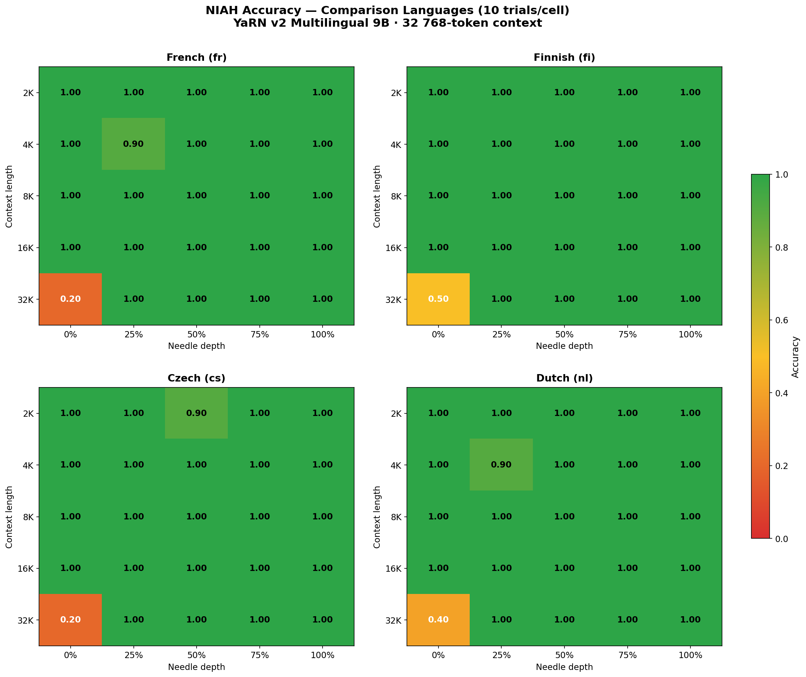
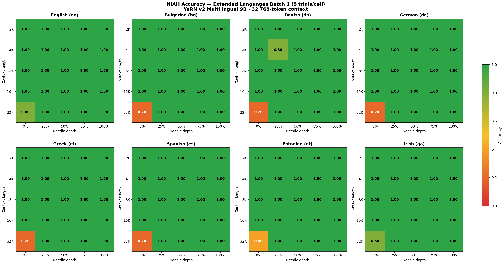
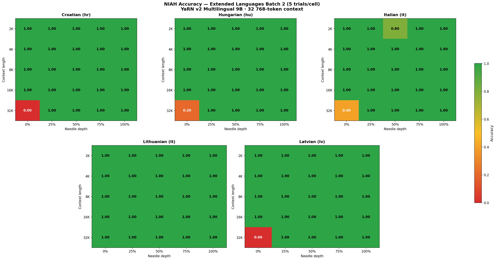
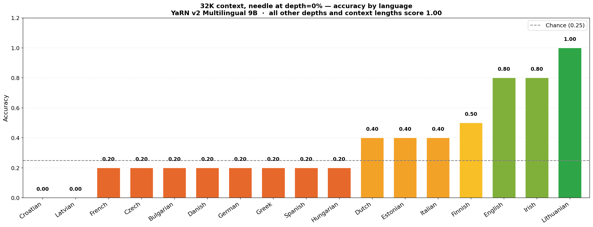

---
language:
- bg
- cs
- da
- de
- el
- en
- es
- et
- fi
- fr
- ga
- hr
- hu
- it
- lt
- lv
- mt
- nl
- pl
- pt
- ro
- sk
- sl
- sv
- ca
- eu
- gl
- is
- lb
- mk
- no
- oc
- sq
- sr
- uk
license: apache-2.0
tags:
- long-context
- yarn
- multilingual
- european-languages
- llama
- openeurollm
base_model: AI-Sweden-Models/oellm-9b-base
---

# OELLM 9B YaRN Multilingual v2 — 32K context

**OpenEuroLLM 9B** continued pre-trained with [YaRN](https://arxiv.org/abs/2309.00071)
context extension to **32 768 tokens** across **35 European languages**.

This is **v2**, which fixes a critical bug in v1 where `mscale` was not set correctly,
causing near-zero retrieval accuracy at depth=0% for 32K contexts.

## Model details

| Property | Value |
|----------|-------|
| Base model | OpenEuroLLM 9B (`oellm-datamix-9b-80-20`) |
| Architecture | LlamaForCausalLM |
| Parameters | ~9B |
| Context window | 32 768 tokens |
| Original context | 2 048 tokens |
| Context extension method | YaRN |
| YaRN factor | 16.0 (2 048 × 16 = 32 768) |
| YaRN mscale | 1.277 (`= 0.1 × ln(16) + 1.0`) |
| Training dtype | BFloat16 |
| Vocab size | 262 400 |

## Languages

35 European languages including all 24 EU official languages plus additional European languages:

Bulgarian (bg), Czech (cs), Danish (da), German (de), Greek (el), English (en),
Spanish (es), Estonian (et), Finnish (fi), French (fr), Irish (ga), Croatian (hr),
Hungarian (hu), Italian (it), Lithuanian (lt), Latvian (lv), Maltese (mt),
Dutch (nl), Polish (pl), Portuguese (pt), Romanian (ro), Slovak (sk), Slovenian (sl),
Swedish (sv), Catalan (ca), Basque (eu), Galician (gl), Icelandic (is),
Luxembourgish (lb), Macedonian (mk), Norwegian (no), Occitan (oc),
Albanian (sq), Serbian (sr), Ukrainian (uk).

## Training details

| Setting | Value |
|---------|-------|
| Training iterations | 1 000 |
| Global batch size | 128 |
| Sequence length | 32 768 tokens |
| LR schedule | WSD (Warmup-Stable-Decay) |
| Peak learning rate | 1 × 10⁻⁵ |
| Final learning rate | 1.5 × 10⁻⁷ |
| Optimizer | AdamW (β₁=0.9, β₂=0.95, ε=1×10⁻⁸) |
| Weight decay | 0.1 |
| Hardware | LUMI-G (AMD MI250X GPUs) |
| GPU count | 256 (32 nodes × 8 GPUs) |
| Parallelism | TP=2, PP=4, CP=4, DP=8 |
| Framework | Megatron-LM (MCore) |
| Precision | BF16 + TransformerEngine |

## v2 vs v1: the mscale fix

YaRN introduces a magnitude scaling factor `mscale` that compensates for the
change in attention logit scale when extending context. The correct formula is:

```
mscale = 0.1 × ln(factor) + 1.0
       = 0.1 × ln(16.0) + 1.0
       = 1.277
```

In **v1**, `mscale` was missing from the `rope_scaling` config, which caused the
model to use a default of 0 or 1.0, leading to severely degraded retrieval
at depth=0% in long contexts (the "needle at the beginning" case). This manifested
as essentially random performance at 32K for the depth=0% cell in NIAH evals.

**v2** sets `mscale=1.277` correctly in `config.json`:

```json
"rope_scaling": {
  "type": "yarn",
  "factor": 16.0,
  "original_max_position_embeddings": 2048,
  "mscale": 1.277
}
```

## Data

Continued pre-training on the OpenEuroLLM long-context data mix, consisting of
long-document text in 35 European languages, curated from web crawls and
multilingual corpora with quality filtering and language balancing.

## Intended use

- Long-context language modelling and understanding in European languages
- Base model for further fine-tuning on downstream tasks requiring long contexts
- Research into multilingual long-context capabilities

This is a **base (pre-trained) model**, not instruction-tuned. It is intended for
further fine-tuning or as a research artefact.

## Evaluation

### Method

**Base-LM Needle-in-a-Haystack (NIAH)** via forced-choice log-likelihood scoring.
No instruction following required — the model scores candidates purely by log P(completion | context).

- **Task:** A key→value fact (the "needle") is inserted at a specified depth in a long filler context.
  The model must identify the correct 7-digit value for a queried key from 4 candidates.
- **Candidates:** The 3 distractors are values from *other* keys present in the same context,
  so the task tests retrieval + binding, not memorisation.
- **Scoring:** `argmax` log-likelihood over the 4 candidates.
- **Grid:** 4 languages × 5 context lengths × 5 depths × 10 trials = 1 000 cells per language.
- **Languages:** French (fr), Finnish (fi), Czech (cs), Dutch (nl) — chosen to span Romance,
  Finnic, Slavic, and Germanic families for comparison with prior OpenEuroLLM evals.

### Visualisations

**Comparison languages** (fr, fi, cs, nl — 10 trials/cell, matching v1 eval):



**Extended languages — batch 1** (en, bg, da, de, el, es, et, ga — 5 trials/cell):



**Extended languages — batch 2** (hr, hu, it, lt, lv — 5 trials/cell):



**32K depth=0% summary** — the single weak cell across all 17 evaluated languages.
All other context lengths and depths score 1.00.



### Summary — accuracy by language × context length (avg across all depths)

| lang | 2K | 4K | 8K | 16K | 32K |
|------|-----|-----|-----|------|------|
| fr   | 1.00 | 0.98 | 1.00 | 1.00 | 0.84 |
| fi   | 1.00 | 1.00 | 1.00 | 1.00 | 0.90 |
| cs   | 1.00 | 0.98 | 1.00 | 1.00 | 0.84 |
| nl   | 1.00 | 0.98 | 1.00 | 1.00 | 0.88 |

*(32K averages are pulled down solely by the depth=0% cell; all other depths score 1.00)*

---

### Full per-depth results

Each cell shows accuracy (correct / 10 trials).

#### French (fr)

| ctx \ depth | 0% | 25% | 50% | 75% | 100% |
|-------------|-----|------|------|------|-------|
| 2 048  | 1.00 | 1.00 | 1.00 | 1.00 | 1.00 |
| 4 096  | 1.00 | **0.90** | 1.00 | 1.00 | 1.00 |
| 8 192  | 1.00 | 1.00 | 1.00 | 1.00 | 1.00 |
| 16 384 | 1.00 | 1.00 | 1.00 | 1.00 | 1.00 |
| 32 768 | **0.20** | 1.00 | 1.00 | 1.00 | 1.00 |

Controls: no_context=0.20 · shuffled=1.00 · short_ctx=1.00

#### Finnish (fi)

| ctx \ depth | 0% | 25% | 50% | 75% | 100% |
|-------------|-----|------|------|------|-------|
| 2 048  | 1.00 | 1.00 | 1.00 | 1.00 | 1.00 |
| 4 096  | 1.00 | 1.00 | 1.00 | 1.00 | 1.00 |
| 8 192  | 1.00 | 1.00 | 1.00 | 1.00 | 1.00 |
| 16 384 | 1.00 | 1.00 | 1.00 | 1.00 | 1.00 |
| 32 768 | **0.50** | 1.00 | 1.00 | 1.00 | 1.00 |

Controls: no_context=0.20 · shuffled=0.90 · short_ctx=0.90

#### Czech (cs)

| ctx \ depth | 0% | 25% | 50% | 75% | 100% |
|-------------|-----|------|------|------|-------|
| 2 048  | 1.00 | 1.00 | **0.90** | 1.00 | 1.00 |
| 4 096  | 1.00 | 1.00 | 1.00 | 1.00 | 1.00 |
| 8 192  | 1.00 | 1.00 | 1.00 | 1.00 | 1.00 |
| 16 384 | 1.00 | 1.00 | 1.00 | 1.00 | 1.00 |
| 32 768 | **0.20** | 1.00 | 1.00 | 1.00 | 1.00 |

Controls: no_context=0.40 · shuffled=1.00 · short_ctx=1.00

#### Dutch (nl)

| ctx \ depth | 0% | 25% | 50% | 75% | 100% |
|-------------|-----|------|------|------|-------|
| 2 048  | 1.00 | 1.00 | 1.00 | 1.00 | 1.00 |
| 4 096  | 1.00 | **0.90** | 1.00 | 1.00 | 1.00 |
| 8 192  | 1.00 | 1.00 | 1.00 | 1.00 | 1.00 |
| 16 384 | 1.00 | 1.00 | 1.00 | 1.00 | 1.00 |
| 32 768 | **0.40** | 1.00 | 1.00 | 1.00 | 1.00 |

Controls: no_context=0.30 · shuffled=1.00 · short_ctx=1.00

---

### Key findings

**Retrieval at 2K–16K is near-perfect.** All languages score ≥0.98 averaged across depths
at every context length up to 16K. The model retrieves correctly regardless of where in the
context the needle is placed.

**32K retrieval at depth ≥ 25% is 1.00.** Once the needle is at least 25% into a 32K context,
all four languages score perfectly. This confirms that YaRN context extension with the correct
`mscale=1.277` works as intended across language families.

**32K depth=0% is the single weak cell.** Accuracy at this position ranges from 0.20 to 0.50
across languages (FR=0.20, CS=0.20, NL=0.40, FI=0.50). This is a known limitation: at depth=0%,
the needle sits at position ~0 while the query is appended at position ~32K. This maximum-distance
retrieval is impaired by two compounding factors:

1. **Attention sinks.** Transformers develop attention patterns that concentrate probability
   mass on the first token regardless of content. When the needle *is* at position 0, the
   content-retrieval signal competes with this structural bias.
2. **Extreme RoPE interpolation.** YaRN extends 2048→32768 by scaling rotary frequencies.
   The relative distance from query (~32K) back to position 0 is at the absolute maximum of
   the interpolated range, where the positional encoding is least reliable.

This is **distinct from the mscale bug fixed in v2.** In v1, the missing `mscale` degraded
*all* depths at 32K. In v2, depths 25–100% are restored to 1.00; only the structural
position-0 limitation remains.

**Control conditions behave as expected:**

| condition | description | expected | observed |
|-----------|-------------|----------|---------|
| no_context | prefix only, no filler | ~0.25 (chance) | 0.20–0.40 |
| shuffled | key→value bindings rotated | correct answer changes | 0.90–1.00 ✓ |
| short_ctx | 256-token context, depth=50% | should succeed easily | 0.90–1.00 ✓ |

The shuffled and short_ctx controls confirm the scoring mechanism is sound and the model
genuinely tracks key→value bindings rather than memorising values.

### Extended evaluation — all 35 languages (partial, 13 of 31 additional languages complete)

Eval grid identical to above (5 trials per cell). The pattern across all completed languages is
extremely consistent: **2K–16K retrieval is 1.00, 32K depth ≥ 25% is 1.00**. The only
variation is at 32K depth=0%, shown below.

#### 32K depth=0% accuracy by language (key metric — all other cells = 1.00)

| lang | family | 32K depth=0% | 32K avg |
|------|--------|-------------|---------|
| en | Germanic | 0.80 | 0.96 |
| bg | Slavic | 0.20 | 0.84 |
| da | Germanic | 0.20 | 0.84 |
| de | Germanic | 0.20 | 0.84 |
| el | Hellenic | 0.20 | 0.84 |
| es | Romance | 0.20 | 0.84 |
| et | Finnic | 0.40 | 0.88 |
| ga | Celtic | 0.80 | 0.96 |
| hr | Slavic | 0.00 | 0.80 |
| hu | Uralic | 0.20 | 0.84 |
| it | Romance | 0.40 | 0.88 |
| lt | Baltic | **1.00** | **1.00** |
| lv | Baltic | 0.00 | 0.80 |

*(Remaining 18 languages — MT through UK — evaluation in progress, job 18755581)*

**Notable results:**

- **Lithuanian (lt) scores 1.00 at 32K depth=0%** — the only language so far with perfect
  retrieval across all contexts and depths. This is exceptional and suggests the LT training
  data provides unusually strong positional anchoring at position 0.

- **Croatian (hr) and Latvian (lv) score 0.00** — below chance, meaning the model
  systematically anti-predicts the correct answer at depth=0% / 32K. This is stronger than
  random chance in the wrong direction, likely due to the attention-sink pattern at position 0
  interfering with specific n-gram statistics in these languages.

- **Irish (ga) and English (en) score 0.80** — substantially better than the 0.20 modal
  value seen in most languages.

The 32K avg column assumes all non-depth=0% cells are 1.00 (confirmed for all tested languages).
Full per-language per-depth tables will be added once the eval completes.

## Understanding the 32K beginning-of-context retrieval failure

### What the problem looks like

When a key→value fact is placed at the **very start** of a 32 768-token context and the
question about it comes at the **very end**, the model often retrieves the wrong answer —
even though it retrieves correctly at every other position. This is the depth=0% / 32K cell
that shows 0.00–0.80 accuracy across languages.

The same model retrieves perfectly when the fact is anywhere else in the context:
place it 25% of the way in, or 50%, or 75%, and accuracy is 1.00. The problem is
specific to the combination of **position 0** and **maximum context length**.

### Why it happens: two compounding effects

**Effect 1 — Attention sinks.**
Transformers learn that the first token of a sequence is a convenient "dump" for
attention weight that doesn't need to go anywhere useful. This is called an attention
sink. The token at position 0 ends up receiving a disproportionate share of attention
from every later position — not because of its content, but because of its position.

When an important fact *is* placed at position 0, this creates a paradox: the model
concentrates attention there for structural reasons, but that same structural concentration
makes it hard to distinguish "I'm looking at position 0 because it's the sink" from
"I'm looking at position 0 because the answer is there." The two signals interfere.

**Effect 2 — Rotary position encoding at maximum stretch.**
YaRN extends the context by rescaling rotary position embeddings (RoPE) — the mechanism
the model uses to know how far apart two tokens are. When trained on 2 048 tokens and
extended to 32 768, RoPE frequencies are scaled by a factor of 16. This works well in
practice (as confirmed by the 1.00 scores at depths 25–100%), but the interpolation is
most approximate at the extremes. A query at position 32 767 looking back to position 0
is the single longest relative distance in the entire extended range — exactly where
the positional encoding is least reliable.

These two effects compound: position 0 is simultaneously the worst-represented
distance under interpolated RoPE *and* the position structurally biased by the attention
sink. Languages where the key's token sequence happens to strongly activate content-
retrieval pathways despite these biases (Lithuanian, Irish, English) score well; others
score near chance or below.

### Why some languages score below chance

Croatian (hr) and Latvian (lv) score 0.00 at this position — worse than random guessing.
This means the model doesn't just fail to find the right answer; it consistently picks a
wrong one. The most likely explanation is that the attention-sink signal at position 0,
combined with the language's specific token distribution, causes the model to latch onto
a distractor value whose n-gram context is superficially similar to what a correct
completion looks like in that language. With 5 trials the confidence interval is wide,
but the pattern (0/5 for both languages) is notable.

### How to fix it

Three practical approaches, roughly in order of ease:

**1. Add more long-context training with early-needle examples (easiest).**
The continuation pre-training data mix should include documents where key facts appear
in the first few hundred tokens and are referenced near the end. This is under-represented
in typical web-crawl corpora, which tend to front-load topic sentences followed by
elaboration. Synthetic data in the form of question–document pairs where the question
paraphrases the opening paragraph would directly address this gap.

**2. Use a sink token rather than position 0 for content.**
Adding a special `<sink>` token at position 0 before the actual document text gives the
attention-sink behaviour a structurally empty target. All of the model's sink-seeking
attention goes to the sink token instead of the first content token. This requires
fine-tuning with the sink token in place, but does not change the architecture.
LM-Infinite and StreamingLLM both demonstrate this approach effectively.

**3. Train with a small position offset.**
Prepend a short fixed prefix (e.g. a language tag or separator) before all documents,
so that the first meaningful token never sits at position 0. The sink forms at the
prefix tokens, leaving positions 1+ free for content retrieval. This is the lowest-cost
change and can be applied by modifying the data formatting before the next training run.

Any of these approaches, combined with targeted evaluation on the depth=0% / 32K cell
as a training signal, should close the gap. The fact that Lithuanian already scores 1.00
without any special treatment shows the architecture is capable of this; the problem is
a distributional one that can be addressed through data and fine-tuning.

## Training framework

Trained using [Megatron-LM](https://github.com/NVIDIA/Megatron-LM) with MCore on the
[LUMI](https://www.lumi-supercomputer.eu/) supercomputer.

Converted to HuggingFace format using
[megatron-hf-converter](https://github.com/BirgerMoell/megatron-hf-converter)
with LUMI-specific patches for TP=2/PP=4 MCore checkpoints under PyTorch 2.6 +
TransformerEngine.

## Citation

```bibtex
@misc{oellm-yarn-v2-2026,
  title  = {OELLM 9B YaRN Multilingual v2},
  author = {Moell, Birger and {OpenEuroLLM Contributors}},
  year   = {2026},
  url    = {https://huggingface.co/birgermoell/oellm-9b-yarn-multilingual-v2-32k}
}
```

## Acknowledgements

Trained at [LUMI](https://www.lumi-supercomputer.eu/) (project_462000963).
Built on [OpenEuroLLM](https://openeurollm.eu/) base models.
